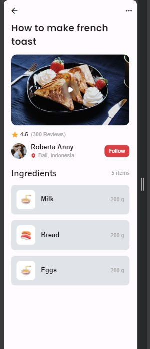

# Project Description
The Flutter Food Recipe app provides users with a platform to explore and learn various recipes. It offers a user-friendly interface to view recipe videos, read reviews, and access ingredient lists, enhancing the cooking experience for users.

## Implementation Details
To design the app's UI, I utilized various widgets and organized them into reusable components. Here's a breakdown of the implementation:

### Appbar Widget
The `Appbar` widget is responsible for displaying the top navigation bar with the app title and any additional actions or icons. It ensures consistency across screens and enhances navigation within the app.

### Video Widget
The `VideoImage` widget displays a background image for the recipe video. It enhances the visual appeal of the recipe page and provides users with a preview of the cooking process.

### Reviews Widget
The `Reviews` widget presents user reviews and ratings for the recipe. It helps users gauge the popularity and quality of the recipe based on community feedback.

### UserProfile Widget
The `UserProfile` widget showcases the profile image, name, and location of the user who shared the recipe. It adds a personal touch to the recipe page and fosters a sense of community among users.

### IngredientSection Widget
The `IngredientSection` widget lists the ingredients required for the recipe. It provides users with a comprehensive overview of the necessary items, facilitating the preparation process.

## Code Structure
I structured the codebase to promote reusability and maintainability by organizing related widgets into separate files within the `widgets` folder. Here's how the code is structured:

- `main.dart`: Contains the main entry point of the app and configures the MaterialApp.
- `widgets` folder:
  - `Appbar.dart`: Defines the `Appbar` widget for the top navigation bar.
  - `VideoImage.dart`: Implements the `VideoImage` widget for displaying recipe videos.
  - `Reviews.dart`: Includes the `Reviews` widget for showcasing user reviews and ratings.
  - `UserProfile.dart`: Defines the `UserProfile` widget for displaying user profiles.
  - `IngredientSection.dart`: Contains the `IngredientSection` widget for listing recipe ingredients.

## Font and Colors Usage
I utilized the specified Poppins font family and colors to maintain consistency and adhere to the design requirements. Here's how they were implemented:

- **Font Family**: I imported the Poppins font family using the `google_fonts` package and applied it to text styles throughout the app, ensuring consistent typography.
- **Colors**: I used the specified colors (A9A9A9, 000000, 303030, E23E3E) for various UI elements, including backgrounds, text, and buttons, to create a cohesive visual experience.

## Git Usage
I followed the following Git workflow throughout the development process:

1. **Cloning the Repository**: Initially, I cloned the repository [wptechprodigy/foodrecipe](https://github.com/wptechprodigy/foodrecipe), which contains the project instructions and setup.

2. **Creating a New Repository**: After cloning the repository, I disconnected from it using `rm -fr .git` and then created my own Flutter app within the same directory. Subsequently, I initialized a new Git repository for my Flutter app and connected it to my GitHub account as a new repository.

3. **Pushing Initial Changes**: I pushed the cloned repository and the Flutter demo setup to my main branch in the new repository.

4. **Development on Feature Branch**: I created a new branch named `project` for the development of the Flutter app. I implemented features and enhancements on this branch, committing changes at meaningful points.

5. **Pushing Changes to Feature Branch**: As I progressed with the development, I pushed each change to the `project` branch in my repository.

6. **Creating Pull Request**: Once the development was complete or at a stable state, I created a pull request from the `project` branch to the main branch.

7. **Code Review and Merge**: I conducted a thorough code review of the changes in the pull request and merged it into the main branch after ensuring the quality and functionality of the code.

By following this Git workflow, I maintained version control and collaboration throughout the development process, ensuring the stability and integrity of the project.

## Screenshots

